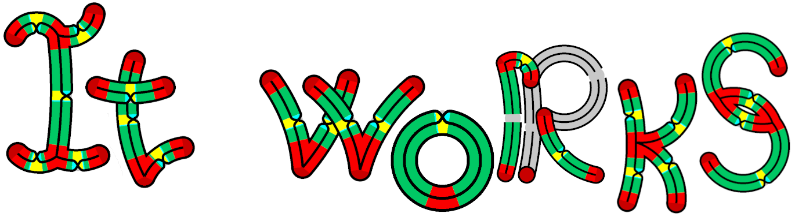

# VirtualPolyhedraRedactor
Potentially simple interactive qt-based redactor for virtual polyhedra diagrams

## What is virtual polyhedra?
Virtual polyhedron is a 2-dimensioal CW-complex of special type. Such an objects can define topological 3-manifold. This representation is convinient to explore the Matveev complexity of 3-manifolds. 

Formally talking, virtual polyhedron is a CW-complex with only 4 allowed neigborhoods for each point:

For a sake of simplicity one could think of virtual polyhedra as 4-regular non-oriented graphs with a set of disks glued to this graph such that to every edge of a graph locally glued 3 disks:

## What do this project do?
To visualize theese objects special diagrams are used: 

But nowdays it takes about an hour to draw such a diagram. This project is aimed to speed up this process. It is just a home-project so development is a bit slow. But such an example now can be done in a minute approximately:

## How does it work?

On the current state the only thing you can do is to draw a whatever graph you want. To connect two nodes with names "x" and "y" by edge you need to write the pair "(x,y)" into input line. You can pass several pairs into input line divided by spaces. If there is no node with such a name it will be automatically added to the screen. Whenever you want -- you can add more edges or nodes. 

You can move nodes by a cursor and change curvature of edges by dragging the middle of the arc. By right-click on the middle you can open a menu with all possible rotations of an edge.

If the edge turns gray then you placed the edge too close to another one (bad crossing), try to move it in another position. It was done to hide weird effects of such an intersection and should not bother correct layouts of diagram (where all important parts of diagram can be seen).

Nevertheless,

*\*somehow\**
